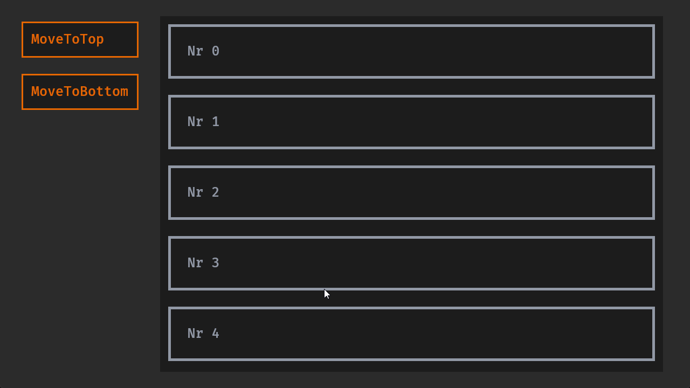

# Bevy Simple Scroll View

[](https://crates.io/crates/bevy_simple_scroll_view)
[](https://docs.rs/bevy_simple_scroll_view)
[](https://github.com/Leinnan/bevy_simple_scroll_view#license)
[](https://bevyengine.org/learn/quick-start/plugin-development/#main-branch-tracking)
[](https://crates.io/crates/bevy_simple_scroll_view)

Simple to use plugin implementing ScrollView into Bevy engine. Supports scroll using dragging and scrolling, should work on all platforms.



More details available in [simple.rs example](examples/simple.rs).

## Installation

```sh
cargo add bevy_simple_scroll_view
```

## Contributing

Please feel free to open a PR, but keep in mind this project's goals. This is meant to be a simple scroll view widget.

The code should be simple enough for users to quickly understand and modify for their own purposes.

Please keep PRs small and scoped to a single feature or fix.

## Planned features

- horizontal scroll, should be pretty simple.
- **MORE DOCS**
- _optional_ if there would be simple enough implementation I would consider adding scrollbars.

## Bevy compatibility table

Bevy version | crate version
--- | ---
0.14 | 0.2
0.13 | 0.1
